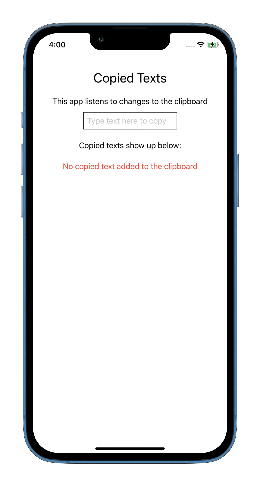
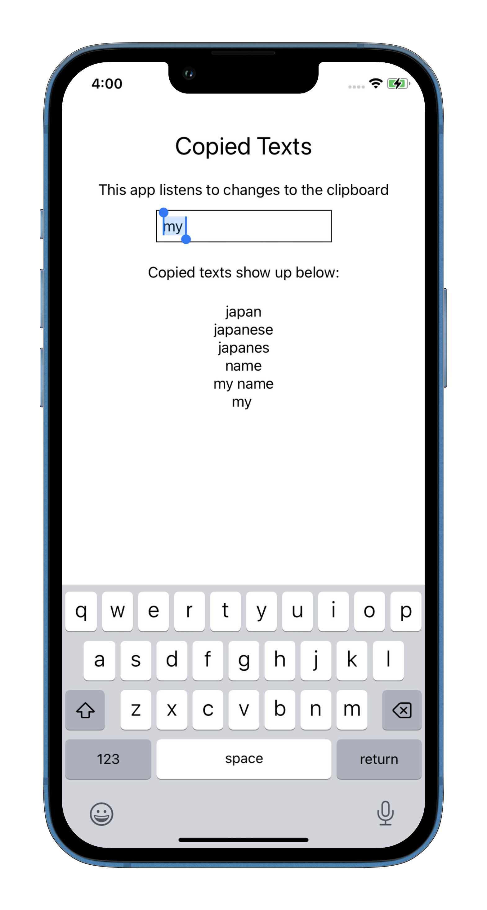

# copiedTexts

A simple SwiftUI app that displays the texts that the user has copied by reading the Clipboard. The app subscribes to the changedNotification event of `UIPasteboard` and updates the UI whenever a new text is copied.   
